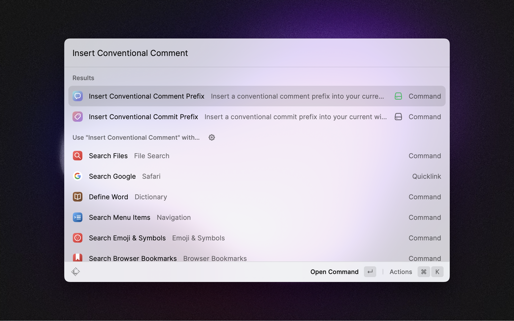
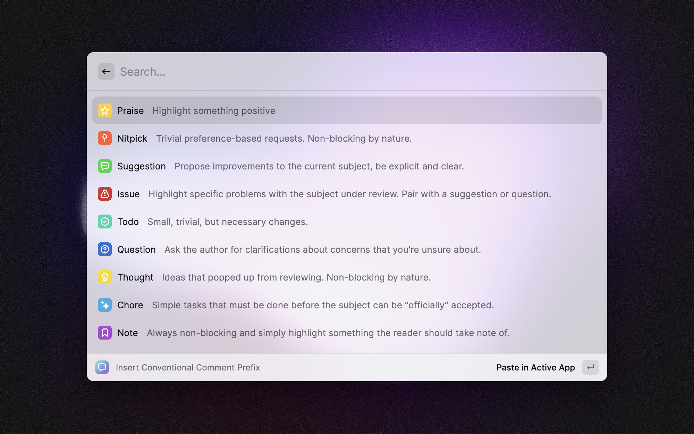

# Conventional Comments

Provides a list and description of conventional comment prefixes that can be inserted into the active window. Aimed at developers to provide an easy cheat-sheet of all the Conventional Comment prefixes and their meanings.

